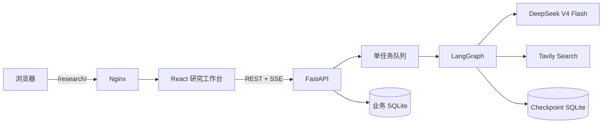

# ResearchFlow

ResearchFlow 是一个面向简历演示的中文深度研究 Agent。它不是聊天机器人，而是把一个主题拆成可编辑的研究计划，联网收集多来源资料，经过证据提取、去重重排和引用校验后生成可分享的中文报告。

## 项目亮点

- 使用 LangGraph 显式编排研究状态，而不是在单个 Prompt 中完成所有工作。
- 规划后暂停，允许用户修改研究重点和子问题，再恢复执行。
- 快速模式关闭 DeepSeek thinking；深度模式开启 thinking，并增加补充检索和引用修订。
- Tavily 并行搜索，来源经过 URL 规范化、去重和证据提取。
- SSE 实时展示规划、搜索、写作和校验进度。
- 匿名限额、进程内有界队列、七天自动过期，适配 2 核 2 GB 服务器。
- Fake Provider 支持本机测试，不消耗真实模型或搜索额度。

## 系统位置



Agent 工作流：

`输入校验 → 问题规划 → 人工确认 → 并行搜索 → 去重重排 → 证据提取 → 报告生成 → 引用校验 → 保存`

## 技术栈

- 前端：React、TypeScript、Vite、Tailwind CSS、Vitest、Playwright
- 后端：Python 3.12、FastAPI、SQLAlchemy、SQLite、pytest
- Agent：LangGraph、LangChain OpenAI Adapter、DeepSeek V4 Flash、Tavily
- 部署：Nginx、systemd、Uvicorn 单进程

## 本地启动

后端：

```powershell
cd backend
Copy-Item .env.example .env
python -m pip install -e ".[dev]"
python -m uvicorn app.main:app --reload
```

前端：

```powershell
cd frontend
pnpm install
pnpm dev
```

本地开发环境只有真实回环客户端会绕过每日限额。自动化测试使用 Fake Provider，不需要填写 API Key；如果只想本机体验完整流程，可在 `.env` 中设置 `RESEARCHFLOW_PROVIDER_MODE=fake`。

## 验证命令

```powershell
cd backend
python -m pytest -p no:cacheprovider
python -m ruff check --no-cache .
```

```powershell
cd frontend
pnpm test
pnpm typecheck
pnpm build
pnpm e2e
```

## 服务器部署

1. 将项目放到 `/opt/researchflow`，复制 `backend/.env.example` 为 `backend/.env` 并填写真实密钥。
2. 将 `deploy/nginx-researchflow.conf` 中的 location 配置合并到现有 Nginx 站点。
3. 安装 Node.js、pnpm、Python 3.12 后，以 root 执行 `deploy/deploy.sh`。
4. 访问 `http://服务器公网IP/research/`。

systemd 服务会在启动命令中强制使用 `production` 环境，并在密钥仍为占位符或 HMAC 密钥不足 32 位时拒绝启动。部署脚本不会安装 MySQL、Redis、Celery 或 Docker。业务数据保存在 `/opt/researchflow/backend/data`，请按服务器备份策略定期备份该目录。

## 环境变量

| 变量 | 用途 | 默认值 |
| --- | --- | --- |
| `RESEARCHFLOW_ENVIRONMENT` | `development` 或 `production` | `development` |
| `RESEARCHFLOW_PROVIDER_MODE` | `real` 使用真实 API，`fake` 用于本机演示 | `real` |
| `RESEARCHFLOW_MODEL_BASE_URL` | OpenAI 兼容模型地址 | `https://api.deepseek.com` |
| `RESEARCHFLOW_MODEL_NAME` | 模型 ID | `deepseek-v4-flash` |
| `RESEARCHFLOW_MODEL_API_KEY` | DeepSeek API 密钥 | 无 |
| `RESEARCHFLOW_TAVILY_API_KEY` | Tavily API 密钥 | 无 |
| `RESEARCHFLOW_IP_HASH_SECRET` | IP HMAC 密钥 | 仅供本机开发的默认值 |
| `RESEARCHFLOW_DATABASE_PATH` | 业务数据库路径 | `data/researchflow.sqlite3` |
| `RESEARCHFLOW_CHECKPOINT_DATABASE_PATH` | LangGraph 检查点路径 | `data/checkpoints.sqlite3` |

## 范围边界

首版不包含账号系统、文件上传、向量数据库、Redis/Celery、多搜索服务容灾和后台管理。当前属于实时 Web RAG：检索来自搜索 API，不需要为每次只有 4–8 个临时来源维护向量索引。
